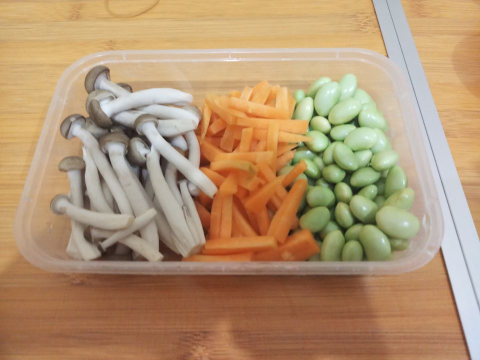

- Nah yg minta resepnya udh kutulis ya!!!!
- Bacanya sante aja lah ya awkwkwkwk
- Ingredients:
- 1 cup beras
- 1/2 cup edamame mentah kupas
- 1/2 cup wortel *potong memanjang
- 1/2 cup jamur segar
- 2 siung b.putih *cincang
- 2 siung b.merah *iris tipis2
- 2 sdm minyak goreng
- 1 sdm hondashi bubuk (bisa diganti kaldu bubhk)
- 1 sdm mirin (kalo kau rasa haram gk ush dipake, gk ush bnyk bacot)
- 1 sdm kecap asin kikoman
- Merica
- Garam
- Step:
- 1. Panaskan minyak tumis bawang putih n bawang merah hingga harum (seharum kenangan indahmu dengan dia)
- 2. Cuci beras di air mengalir (biar kan mengalir seperti kenangan dia yg skrng sudah bahagia dengan si doi), masukkan beras yg sudah dicuci ke dalam ricecooker.
- 3. Masukkan air sesuai takaran hingga beras tengellam (seperti kau yg ingin menenggelamkan mantanmu n pacar barunya ke sungai)
- 4. Masukkan hondashi bubuk, kecap asin, mirin,merica, n garam(kalo kaldumu udh asin gk ush di asin2kan hidup kau udh cukup asin, udh ditinggal pacar, kerja u ampas, apalagi..? GATCHA MU SAMPAH!!)
- 5. Aduk semua hingga rata (seperti hatimu yg teraduk2 tidak karuan)
- 6. Tuangkan tumisan bawang dan potongan sayur di atas beras *jangan diaduk (jangan diaduk ya, bs denger gk kau! jangan bandel x kau gk bs dibilangi, udh dibilang jangan di aduk malah kau aduk.. pantes lah kau ditinggal pacar kau BODAT)
- 7. Tutup dan masak nasi hingga matang, kalau sudah matang biarkan selama 10 menit jangan dibuka agar nasi dan sayur matang sempurna (jangan kek org rakus x kau cem udh sebulan gk makan gk sabar x mao cpt makan.. bs sabaran gk ha!!!)
- 8. Sesudah 10 menit buka, aduk dan campur nasi bersama sayur hingga tercampur rata (seperti hatimu yg tercampur aduk ingin melupakan doi tp tak bs prfffff..)
- 9. Sajikan ke mangkuk, nasi siap disantap (makan kau itu sambil meratapi mirisnya hidupmu!!!)

## Links
- https://www.facebook.com/riku.kun.7792/posts/243688290339912
