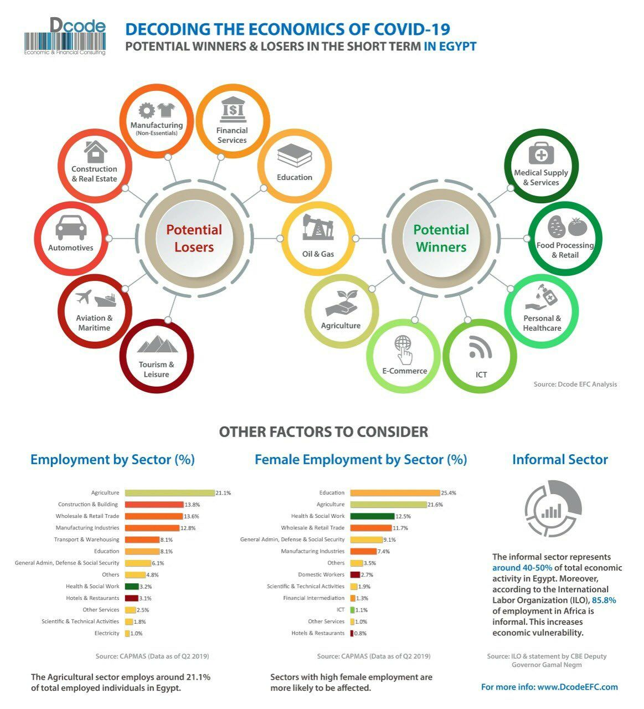

You infect 1.3 people with the flu on avg
You infect 3 people with Covid-19 on avg
That may not sound like much, but if each person infects that many also, and it happens 10x?
You’ve infected 14 people with the flu, and 59,000 with coronavirus.

Beberapa bahan ternyata berbahaya jika disemprotkan ke tubuh langsung, baca lebih lengkap di [tanggapan Sekolah Farmasi ITB terhadap disinfektan bilik](https://fa.itb.ac.id/tanggapan-terhadap-disinfektan-bilik/)

When we think of the future, we tend to think of obvious and immediate consequences. As a result, we tend to ignore the _domino chain of effects_.

## Links

- [Protokol Isolasi Mandiri](https://tirto.id/protokol-isolasi-mandiri-bagi-pasien-positif-covid-19-tanpa-gejala-eJZt)
- [The lockdown: One month in Wuhan](https://www.youtube.com/watch?v=XU9FVqwO4TM)
- [[Coronavirus] Second Order Effects](https://docs.google.com/document/d/17YkH4kc63t7JI7JJZR6i3-iebJd7kfRAzAK_ssl8bt4/edit?usp=sharing)
- [Virus Corona: Dari Seorang Warga Awam](http://proses.id/corona/)
- [Why fighting the coronavirus depends on you](https://www.youtube.com/watch?v=dSQztKXR6k0)
- [What Actually Happens If You Get Coronavirus?](https://www.youtube.com/watch?v=OTYfke545vI)
- [Sebuah GIF menjelaskan mengapa kita harus diam dirumah](https://twitter.com/AnanyaS1190/status/1241590500571910144)
- [How to boost you immune system against Covid-19 (Coronavirus)?](https://twitter.com/febrinasugianto/status/1238774559190347776)
- [Kamu akan menularkan 3 orang dengan covid19, sedangkan flu 1.3](https://twitter.com/AlexWhitcomb/status/1241943303563739136)
- [Hati-hati terhadap cairan yang digunakan pada Disinfektan Bilik](https://fa.itb.ac.id/tanggapan-terhadap-disinfektan-bilik)
- [Video tips menjelaskan Disinfek barang belanjaan setelah ke pasar](https://www.youtube.com/watch?v=4A_1h4XpMes)
- [Mass Disinfections to Combat Coronavirus post another heatlh hazard](https://www.reuters.com/article/us-health-coronavirus-disinfection/mass-disinfections-to-combat-coronavirus-pose-another-health-hazard-idUSKBN21I1PB)
- [What happened to one man's family when he got the coronavirus in Wuhan](https://www.youtube.com/watch?v=yWsPCnNYIu8&t=861s)
- [Sebuah Panduan Bagaimana sebaiknya Mencegah agar tidak Tertular COVID-19 dan apa yang sebaiknya dilakukan jika Tertular](https://medium.com/@salsabeela/mari-tetap-hidup-perbaiki-penanganan-covid-19-di-indonesia-997a5144114)
- [Is The Coronavirus Outbreak Making You Anxious? Here’s Why This Happens And Some Tips For ](https://www.forbes.com/sites/victoriaforster/2020/04/05/is-the-coronavirus-outbreak-making-you-anxious-heres-why-this-happens-and-some-tips-for-coping)
