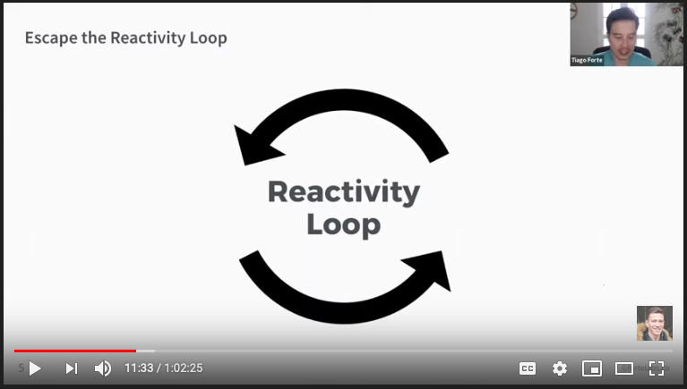
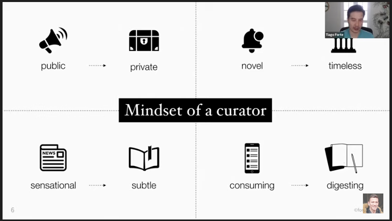

What is Smart Sync?
---
A system to turn the idea from internet into writing
This system is derived from the workshop created by Tiago Forte called "Building the Second Brain"

What will I get from this workshop?
A shifted perspective toward information from something that is chaotic and overwhelming and sort of just adds more to the plate and have that switch to just seeing information is this like magical, like force that we can redirect and shape and capture and then unleash.

Capture habit
---
We should capture all the best ideas that we basically absorb, so whether we're
* Reading books, articles
* Listening to podcasts
* Listen to audio books

One of the ways that we can become an order of magnitude more efficient is just to capture all the best ideas to single place. So what the benefit of that? Once we placed all the best ideas in a single place, we can start to use “search”.

Building a Second Brain/Personal Knowledge Management
Instead of spreading out the information and knowledge that we find valuable in life across a million different apps and  folders and different things, centralize it in one place. In a digital notes app, where we have all of the knowledge and expertise at the fingertips ready to go for any project that we want to create, any piece of writing or just for your own understanding and thinking.

Write a Passage
---
When we have the second brain. What is the process like to not just efficiently but really powerfully and effectively turn that into writings.

3 kinds of information
1. Information that is pushed to you. Notifications, popups, every situation where someone else say we want you to read this or consume this.
2. Information that you pull toward you. You decide, oh I would like to learn about this now,  I would like to hear about this now, etc.
3. Information that you create. We’re making the transition form the first one to the second one. Instead of the incoming information just hitting you right on the cortex. We need to create a buffer or a safety zone between the chaos of the information world and your delicate brain.

This workshop will focus to the transition of the first one into the second one.

Escape the Reactivity Loop
---

You really never going to grow your knowledge in the best way if you’re just reacting.
You need to be more intentional about what you consume.

Mindset of Curator
    * Think of this as a curator of a magazine who is only deciding you know which articles and things make.
    * Really choosing and thinking about what you want to add.
    * Start doing this just for yourself, like become your own curator.

Transition to the Mindset of Curator
1. Create a private sphere where you can choose kind of digest something in your own time instead of focusing on things that are public.
2. Naturally focus less on novel things what is just the immediate thing happening right now and more on knowledge that is timeless.
3. Focusing less on sensational and subtle things. Once you collected 10 articles, you look at them and you notice, oh 7 of these just these sensational clickbait headlines and you actually decide just focusing on 3 that are not just kind of click bait.
4. Spend less consuming, right there’s this sort of like compulsive consuming thing that we do. We barely thought one second about what we just read, and we’re already reading something else, it’s sort of like we’re over stimulated like that feeling of being full at the end of a meal but we still want to eat more and it’s not a great feeling. Once we collected all these notes and highlights together one place, we go OMG I have more than I need. Let me start digest it and create something with it.

Think as Knowledge as food
---
Instead of thinking like knowledge is something that you just consume, think that knowledge as food. If you can do this your consumption choices will be a lot better.

> Don’t just eat, you’re also digest it.

That’s why we believe so much that creating things is essential to the journey of building knowledge is because once you go thru the process of creation you then begin to make the information your own and it’s only once food actually begins to go through the digestive system and nutrients are sorted out and stored in the body then we actually begin to benefit from our food.

> Pure passive consumer -> An active producer

There is a value in everything from the most sarcastic tweet to a kind tweet. The key is within the given piece of information, how do you pull out the one, the two or a thousand, the best points.

Think of curation not just about entire sources, but think about within different source, how can you learn & how can you gain value.

Differents between Evernote and Notion
---
- Evernote: free form capture
- Notion: more structured way of capture
Try both of these, since they’re highly complementary

> Don’t save everything to Evernote, that’s not the point

Evernote is like curated place where you know that only the best things that you’ve consumed are which virtually guarantees that when you come across something in Evernote it’s gonna be good.

Instead work with instaper, work with kindle, work with liner and only save the best things. That way you can keep your note-taking system clean and you’ll ensure everything in it is of high quality.

Criteria for what to keep
---

1. Inspiring, is this something that could inspire me if it surfaced at some point in the future?
2. Personal, is this potentially a useful source, building block, or tool for future projects?
3. Useful, is this unique, personal or hard-won knowledge worth revisiting over the years? When you finished a project take like 5 minutes to just make a note, what that I learn?, what that I do well?, what that I've could done better? just a little quick mini personal retrospective over time as you come across those and you sometimes turn them into other things like blog post, e.g. things I learn from my job in consulting. Those are gonna be things that are unique to you that’s your competitive advantage, that’s wisdom that you gained through hard-won experience.
4. Easily lost, is this something that I’m unlikely to find in the future.

Links
---

* North star podcast: https://www.perell.com/podcast/
* https://www.youtube.com/watch?v=lNJ33ImlZzs&t=1528s
