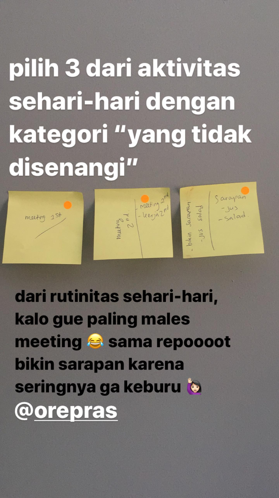
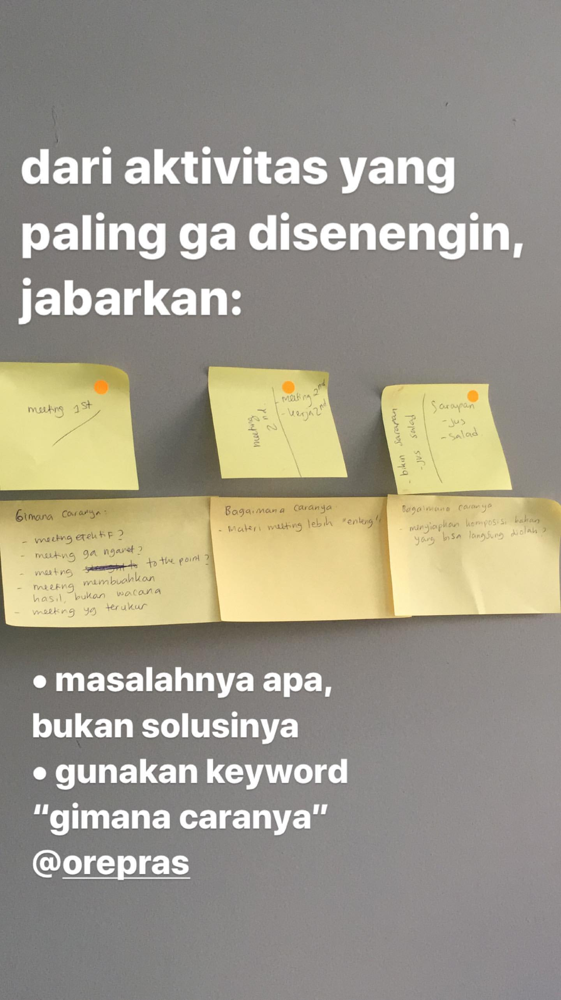
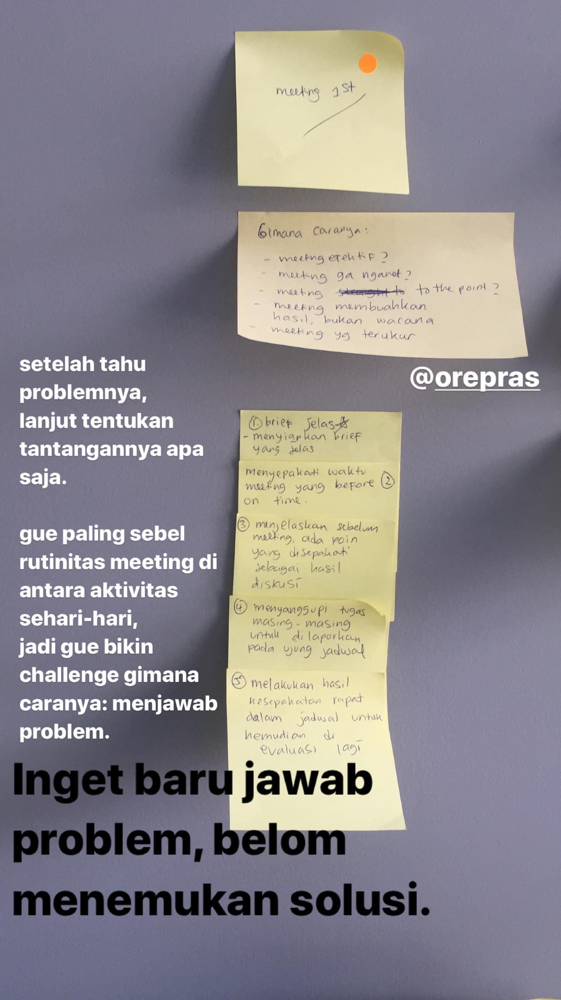
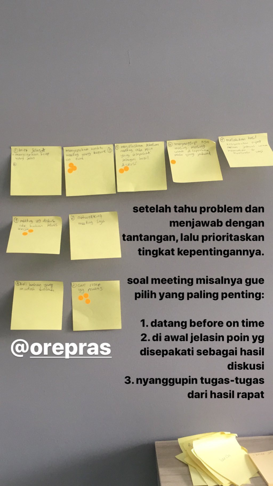
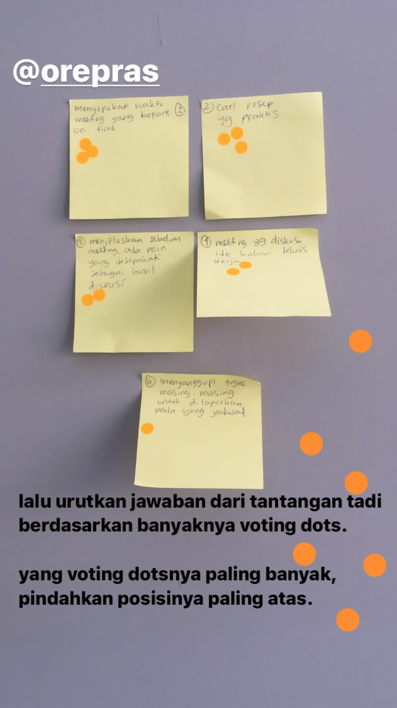
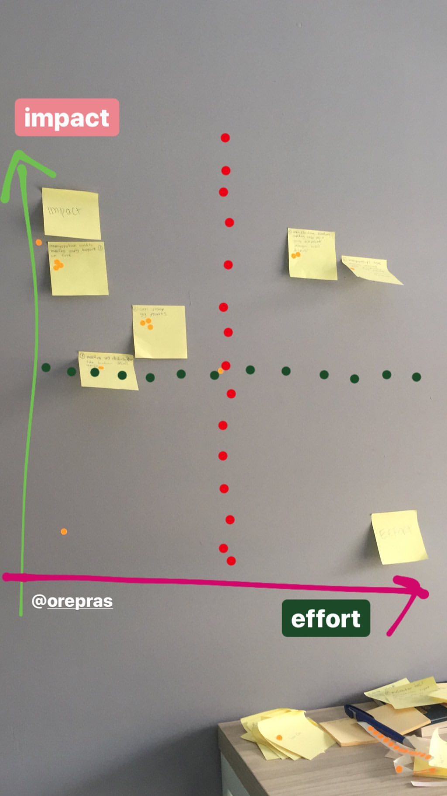
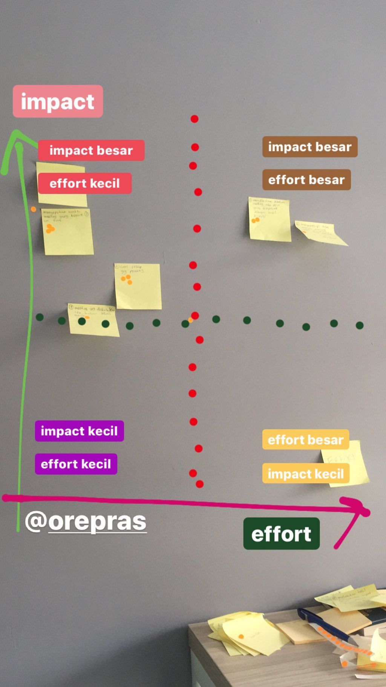
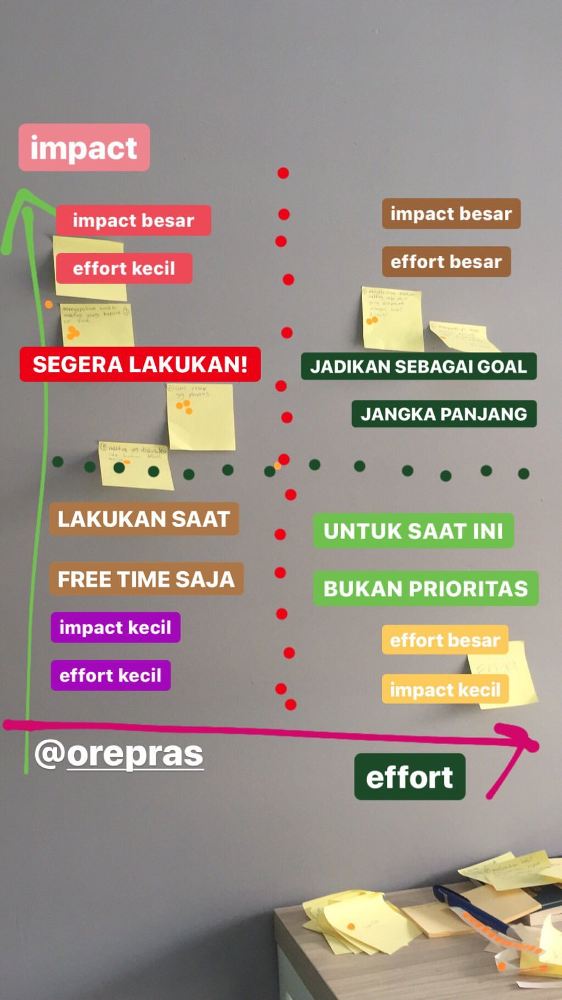
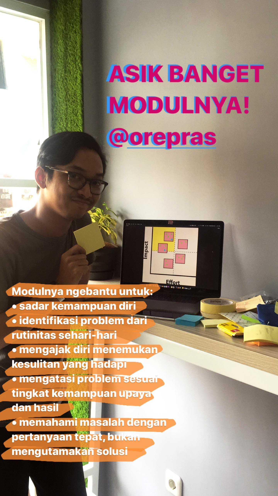
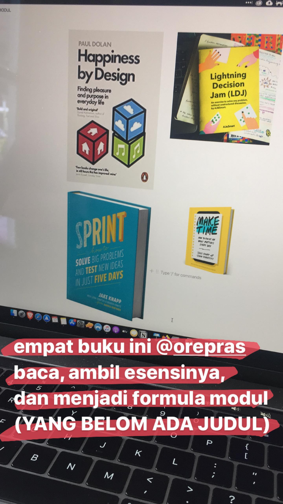

# Metode Rutinitas Prioritas oleh @orepras

merunutkan aktivitas sehari-hari dari melek sampai tidur

rutinitas dari aktivitas dibagi menjadi 2

1. yang disenengin
2. yang ga disenengin

lalu tempel voting dots pada aktivitas dengan tingkat ketidaknyamanan

pilih 3 dari aktivitas sehari-hari dengan kategori yang tidak disenangi

dari aktivitas yg ga disenangi, jabarkan, masalahnya apa? bukan solusinya. gunakan keyword "gimana caranya?”

setelah tahu problemnya, tentukan tantangannya apa aja
**INGAT** baru jawab problem, belum menemukan solusi

setelah tahu problem dan menjawab dengan tantangan, lalu prioritaskan tingkat kepentingannya.

lalu urutkan jawaban dari tantangan tadi berdasarkan banyaknya voting dots.
yang voting dotsnya paling banyak, pindahkan posisinya paling atas.

## Modul ini membantu untuk

- Sadar kemampuan diri
- Identifikasi problem dari rutinitas sehari-hari
- Mengajak diri menemukan kesulitan yang dihadapi
- Mengatasi problem sesuai dengan tingkat kemampuan upaya dan hasil
- Memahami masalah dengan pertanyaan tepat, bukan mengutamakan solusi

## Links

- [https://maketime.blog](https://maketime.blog/)
- Lightning Decision Jam [https://ajsmart.com/courses/lightning-decision-jam](https://ajsmart.com/courses/lightning-decision-jam/)
- [https://www.instagram.com/simpulsendirimodul](https://www.instagram.com/simpulsendirimodul/)
- Sprint [https://www.goodreads.com/book/show/25814544-sprint](https://www.goodreads.com/book/show/25814544-sprint)
- Happyness by Design [https://www.goodreads.com/book/show/18667892-happiness-by-design](https://www.goodreads.com/book/show/18667892-happiness-by-design)

#self-improvement #life-cheatsheet #productivity #workshop
